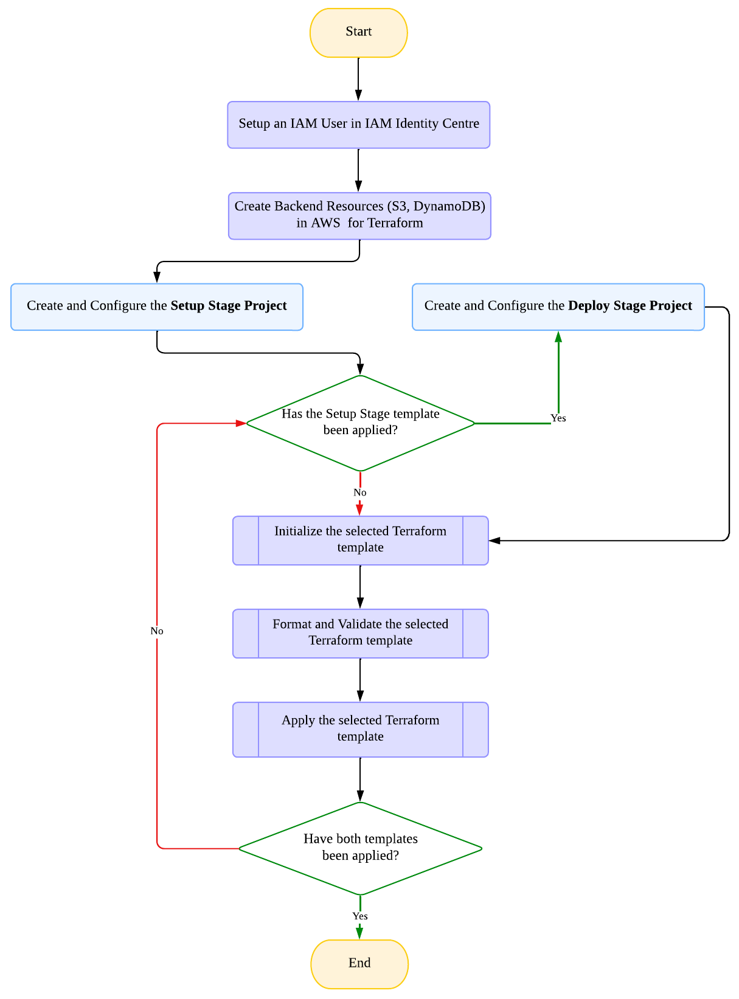
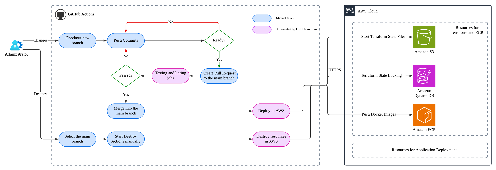
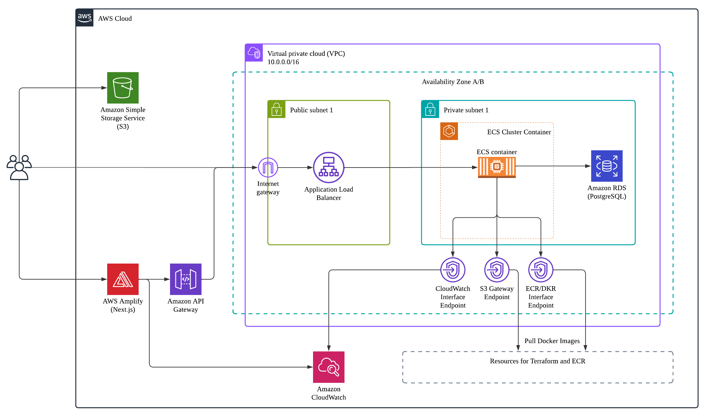
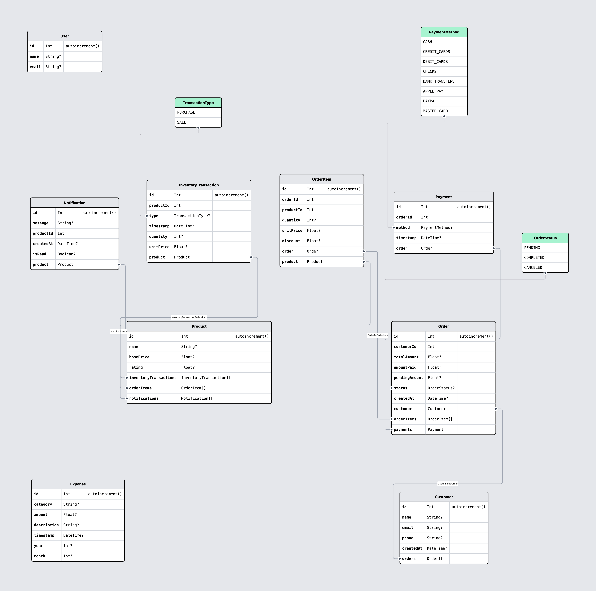

<h1 align="center">E-Sports Inventory Management System</h1>

<p align="center">
  
   
  
  
  
  
  
  
</p>

## 1. Introduction

This project is a **scalable, cloud-native Full-Stack Inventory Management System** built with **Next.js (frontend)** and **Spring Boot (backend)**, fully deployed on **Amazon Web Services (AWS)** with modern DevOps practices.

### 🔥 Key Highlights
✅ **Cloud-Native Deployment** – Fully automated AWS infrastructure managed via **Terraform (Infrastructure as Code)**.  
✅ **CI/CD Automation** – Seamless deployment pipeline using **GitHub Actions** for continuous integration and deployment.  
✅ **State Management & Performance** – **Redux Toolkit** ensures efficient, real-time UI updates.  
✅ **Backend-Driven Data Processing** – All business logic and calculations are handled on the **Spring Boot backend** using a **PostgreSQL database**.  
✅ **Responsive & Scalable** – Optimized for **performance, security, and scalability**, handling large datasets and concurrent users.

This project demonstrates expertise in **full-stack development, cloud architecture, DevOps automation, and scalable infrastructure design**—ideal for enterprise-grade applications. 🚀

---

## 2. Project Demonstration

🔗 **Live Application:** [View Deployed App](https://test.com)  
🛠 **API Documentation (Swagger UI):** [Swagger Endpoints](http://localhost:8080/rest/swagger-ui/index.html)

> 🚀 Explore the live demo and interact with the backend API using Swagger UI.

---

## 3. Tech Stack

### 🚀 Frontend
- **Next.js & TypeScript**
- **State Management**: [Redux Toolkit](https://redux-toolkit.js.org/), [RTK Query](https://redux-toolkit.js.org/rtk-query/overview)
- **UI & Styling**: [Tailwind CSS](https://tailwindcss.com/docs/theme), [Material UI Data Grid](https://mui.com/x/react-data-grid/), [Lucide Icons](https://lucide.dev/)
- **Charts & Visualization**: [Recharts](https://recharts.org/en-US/api)
- **Networking & APIs**: [Axios](https://axios-http.com/), [Next.js Context Providers](https://nextjs.org/docs/app/building-your-application/rendering/composition-patterns#using-context-providers)
- **Notifications**: [Sonner-native](https://gunnartorfis.github.io/sonner-native/Toaster/)

### ⚙ Backend
- **Spring Boot** (REST API, JPA)
- **Postman** (API Testing)

### 🗄 Database
- **PostgreSQL**
- **DBeaver** (Database Management)

### ☁ AWS Cloud Services
- **Compute & Containers**: ECS Fargate, ECR
- **Networking & Security**: VPC, VPC Endpoints, IAM, IAM Identity Center
- **Storage & Databases**: RDS (PostgreSQL), S3, DynamoDB
- **Traffic Management**: ALB, API Gateway
- **Monitoring & Logging**: CloudWatch
- **Frontend Hosting**: Amplify

### 🔄 CI/CD & DevOps
- **Infrastructure as Code**: Terraform
- **Automation & Deployment**: GitHub Actions, Docker Desktop
- **AWS CLI Tools**: [aws-vault](https://github.com/99designs/aws-vault) (for secure AWS authentication), AWS CLI

---

## 4. Define Infrastructure as Code (IaC) using Terraform

The **Terraform workflow** consists of two main stages:

- 🛠 **Setup Stage** (manual, run by a developer) → Configures AWS resources needed for CI/CD (e.g., IAM permissions for deployment).
- 🚀 **Deploy Stage** (automated via GitHub Actions) → Deploys infrastructure and applications to AWS.

By structuring Terraform into **setup** and **deploy** stages, we ensure that deployments remain **version-controlled** and **automated**.

### 📌 Terraform Workflow Diagram
<p align="center">
  
</p>

### 4.1 Access Control for Terraform in AWS
To enable Terraform to manage AWS resources in a **CI/CD pipeline (GitHub Actions)**, we configure access:

✅ **Create a dedicated IAM user for CI/CD** with the necessary AWS permissions.

### 4.2 Backend Resources in AWS for Terraform (Manual)
Terraform requires a **backend** to track state and ensure consistency:

✅ **Amazon S3 (Versioning Enabled)** – Stores Terraform state files, tracking existing resources in the AWS account.  
✅ **Amazon DynamoDB** – Enables Terraform **state locking**, preventing conflicts.

### 4.3 Terraform Workflow - Setup Stage (Run Locally)
This stage provisions essential AWS resources for CI/CD execution:

1️⃣ **Create an IAM user** for GitHub Actions with the necessary permissions.  
2️⃣ **Set up reusable resources**, like an **ECR repository** for storing Docker images.

### 4.4 Terraform Workflow - Deploy Stage (Run via GitHub Actions)
This stage provisions the application infrastructure and deploys the application to AWS.

---

## 5. Deployment Automation

We use **GitHub Actions** for **Continuous Integration (CI)** and **Continuous Deployment (CD)** to automatically manage deployments.

✅ Workflows are stored in `.github/workflows/` and triggered by **GitHub events**.  
✅ Each workflow is structured as **jobs** containing sequential steps.

### 📌 GitHub Actions CI/CD Pipeline Diagram
<p align="center">
  
</p>

### 5.1 Workflows Overview
- **Checks Workflow** → Runs Terraform linting (format & validate).
- **Deploy Workflow** → Linting + deployment to AWS.
- **Destroy Workflow** → Manually triggered to remove AWS resources.

### 5.2 Checks Workflow: Terraform Linting
- **Trigger**: On **pull request** to `main` branch.
- **Jobs**:
  - Run Terraform **formatting** (`terraform fmt`) & **validation** (`terraform validate`).
  - Ensures code quality **before merging**.
  
### 5.3 Deploy Workflow: Build, Push, and Deploy
- **Trigger**: On **pull request** to `main` branch.  
- **Jobs**:  
1️⃣ **Lint** → Reuses `checks workflow`.  
2️⃣ **Build & Push Docker Image**:
  - Builds the Spring Boot app:
    ```sh
    mvn clean package -DskipTests
    ```  
  - Logs into AWS ECR and pushes the Docker image.

  3️⃣ **Terraform Apply** → Deploys infrastructure using Terraform.

### 5.4 Destroy Workflow: Remove AWS Resources
- **Trigger**: **Manually triggered** (`workflow_dispatch`).  
- **Jobs**:
  - **Terraform Destroy** → Removes AWS resources (e.g., RDS, ALB) to **reduce costs**.
  - Ensures **complete cleanup** when infrastructure is no longer needed.

---

## 6. AWS Cloud Architecture

### 6.1 AWS Architecture Overview
We build a **highly available, scalable, reliable, and secure** AWS cloud infrastructure for containerized applications.

### 📌 AWS Architecture Diagram
<p align="center">
  
</p>

### 6.2 Security Best Practices
✅ **Least privilege** IAM permissions  
✅ **Network segmentation** (public & private subnets)  
✅ **Restricted access** via security groups

### 6.3 Infrastructure Setup

### 6.3.1 Networking - Virtual Private Cloud (VPC)
- Create a **VPC** to isolate cloud resources.
- Deploy **two public & two private subnets** across **multiple availability zones (A/B)** for redundancy.
- **Public subnets** host the **Application Load Balancer (ALB)**.
- **Private subnets** host backend services (**ECS, RDS**).

### 6.3.2 Internet & Private Networking
- **Internet Gateway** (public subnets) → Allows inbound access to ALB.
- **VPC Endpoints** (private subnets) for **secure** AWS service access:
    - **S3 Gateway Endpoint** → Access S3 storage.
    - **ECR & DKR Interface Endpoints** → Pull container images from ECR.
    - **CloudWatch Interface Endpoint** → Log ECS & Amplify activities.

### 6.3.3 Database (RDS - PostgreSQL)
- **RDS PostgreSQL** deployed in a **private subnet** → prevents public access.

### 6.3.4 Compute - ECS Fargate
- **ECS Fargate** runs the Spring Boot application as a **serverless, containerized service**, reducing infrastructure management overhead.
- Connects to **RDS & AWS services** via **VPC Endpoints**.

### 6.3.5 Application Load Balancer (ALB)
📌 **ALB Setup:**
- **Public subnets** → Exposes application externally.
- **Security Group** → Allow inbound traffic on **ports 80 & 443**, and allow all outbound traffic to enable communication with backend services.

📌 **Target Group & Health Checks:**
- ALB forwards traffic to **ECS tasks** via a Target Group (IP-based routing, port **8080**).
- **Health checks** (`/rest/actuator/health`) ensure only healthy tasks receive traffic.

📌 **ALB Listeners:**
- **Port 80 → Forwards requests to ECS Target Group**.  

### 6.3.6 CloudWatch Monitoring
- Captures **ECS task logs** for **debugging & monitoring**.

### 6.3.7 Secure External Access
✅ Customers **connect via HTTPS** through **ALB**.  
✅ ALB forwards requests to **ECS tasks** in a private subnet.

### 6.4 Frontend Deployment (Next.js via AWS Amplify)

### 6.4.1 Amplify Hosting
- **Connect GitHub** repository → Select a deployment branch.
- Set **environment variables** in Amplify.

### 6.4.2 API Gateway (HTTPS Enforcement)
⚠️ **Problem**: Amplify (HTTPS) → ECS backend (HTTP) → Causes a **"mixed content"** error.  
✅ **Solution**: **API Gateway** proxies requests securely between Amplify & ECS.

### 6.4.3 S3 for Image Storage
- **S3 bucket** hosts static image files.

### 6.5 ECS Deployment via Terraform

### 6.5.1 Deployment Process
1️⃣ Create an **ECS cluster**.  
2️⃣ Define **IAM roles** (task execution role & task role).  
3️⃣ Create a **task definition** → Configure container settings.  
4️⃣ Deploy an **ECS service** → Runs tasks on Fargate.  
5️⃣ Connect **ECS to ALB** for traffic routing.

### 6.5.2 Create an ECS Cluster
- A **logical grouping** of ECS services & tasks for easy management.

### 6.5.3 IAM Roles
- **Task Execution Role** → Allows ECS to:  
  ✅ Pull container images from **ECR**.  
  ✅ Send logs to **CloudWatch**.
- **Task Role** → Defines application permissions inside the container.
- **Assume Role** → Allows ECS tasks to assume IAM roles dynamically. This is attached to both the **Task Execution Role** and the **ECS Task Role**.

### 6.5.4 CloudWatch Logging
- **CloudWatch Log Group** → Stores ECS task logs for monitoring & debugging.

### 6.5.5 Task & Container Definitions
- **Task Definition**: Configures CPU, memory, networking, IAM roles.
- **Container Definition**:
    - **DB Connection Strings**:
      ```sh
      aws_db_instance.main.address  # RDS hostname
      aws_db_instance.main.db_name  # Database name
      ```
    - **JDBC URL Format**:
      ```sh
      jdbc:postgresql://<address>:5432/<db_name>
      ```
    - **Port Mapping**: `8080:8080`
    - **Logging**

### 6.5.6 ECS Service
✅ Ensures the **correct number of tasks** are running.  
✅ Routes traffic **via ALB**.

### 6.5.7 Security Group Rules
✅ **ALB → ECS** (port **8080**, private subnet)  
✅ **ECS → RDS** (port **5432**, private subnet)

---

## 7. Data Modeling

The database schema was generated using [Prismaliser](https://prismaliser.app/). The ER diagram is as follows:

<p align="center">
  
</p>

---

## 8. Docker

Docker packages the application into a container, ensuring consistent runtime behavior across environments.

- **Base Image**: Uses the **Java Runtime Environment** from the **Eclipse Temurin** project.
- **Working Directory**: Sets `/app` as the working directory (default in Docker).
- **Copying Artifacts**: Transfers the built Spring Boot JAR (`app.jar`) from the `target` directory into the container.
- **Port Exposure**: Exposes port `8080` for application access.
- **Startup Command**: Defines `CMD ["java", "-jar", "app.jar"]` to run the Spring Boot application.

✅ The Dockerfile follows **containerization best practices** by using a lightweight base image, setting a proper working directory, copying the application efficiently, exposing the necessary port, and defining a clear startup command. It integrates seamlessly with **AWS ECS** for scalable deployment.

---

## 9. Backend Implementation

### 9.1 Spring Boot Actuator for ECS Health Check
Spring Boot Actuator is used to expose key application health and monitoring endpoints:

```yaml
management.endpoints.web.exposure.include: info,health,httptrace
```

### 9.2 CORS Handling with `WebMvcConfigurer`
To resolve CORS issues, the application globally configures allowed origins, methods, and headers using the `WebMvcConfigurer` interface. This ensures controlled access from trusted domains while maintaining security by:
- 🚫 **Disabling credential sharing**
- 📦 **Controlling pre-flight caching**

---

## 10. Frontend Implementation

### 10.1 Page Structure
The frontend consists of multiple pages, including:

- **Dashboard**
- **Orders, Products, Customers**
- **Settings, Notifications**
- **Statistics & Charts** _(Orders, Payments, Transactions)_

📊 Statistical analysis is performed on the frontend-side using database-stored data. Tables and charts are **fully responsive**.

### 10.2 Fuzzy Search
A **fuzzy search function** is implemented using the Simple Substring Match with Tolerance for Extra Spaces algorithm.

### 10.3 Material-UI Data Grid
The project utilizes **Material-UI Data Grid** for efficient tabular data handling. Features include:

- 🔎 **Quick Filtering**: Filter rows across multiple columns with a single text input using `<GridToolbarQuickFilter />`.
- 📤 **Export to CSV**: Users can export table data for external use.
- 🛠️ **Advanced Filtering**: The toolbar allows users to filter data using appropriate operators for numbers, dates, and text based on column types.

---

## 11. State Management with Redux Toolkit

This project leverages **Redux Toolkit (RTK)** for centralized state management. This approach ensures a **modular, scalable, and high-performance** state management system.

### 11.1 Global State Management
A **global state** is created using `createSlice` to manage UI variables such as:

- 🗄 **Sidebar collapse state**
- 🌙 **Dark mode preferences**
- 🔔 **Notifications**

📌 State persistence is achieved using **redux-persist**, and **RTK Query** is used for API interactions.

### 11.2 Redux Integration in Components
- **Dynamic UI Updates**: Components use `useAppSelector` to read Redux state and update UI dynamically.
- **Theming & Layout Adaptation**: The dashboard layout adjusts in real-time based on sidebar and theme preferences, ensuring a consistent experience.
- **Notifications** reflect real-time state changes.
- **Typed Hooks**: Custom hooks for dispatching actions and selecting state improve maintainability and type safety.

### 11.3 RTK Query for API Calls
The project integrates **RTK Query** into the Redux store to efficiently manage API requests:

- **Centralized API Slice**: Uses `createApi` to define API endpoints to centralizes all API calls by configuring a base URL and managing endpoints for queries and mutations.
- **Automatic Cache Management**: Endpoints use **tags** to automatically manage cache invalidation, so that any update to the data automatically triggers a refetch of affected queries.
- **RTK Query Generated Hooks**: Pre-generated hooks simplify API call integration in React components, ensuring our UI is always in sync with the latest server data.

---

## 📚 References

- 🎥 https://www.youtube.com/watch?v=ddKQ8sZo_v8
- 🎥 https://www.youtube.com/watch?v=qfOSaCFnYCk
